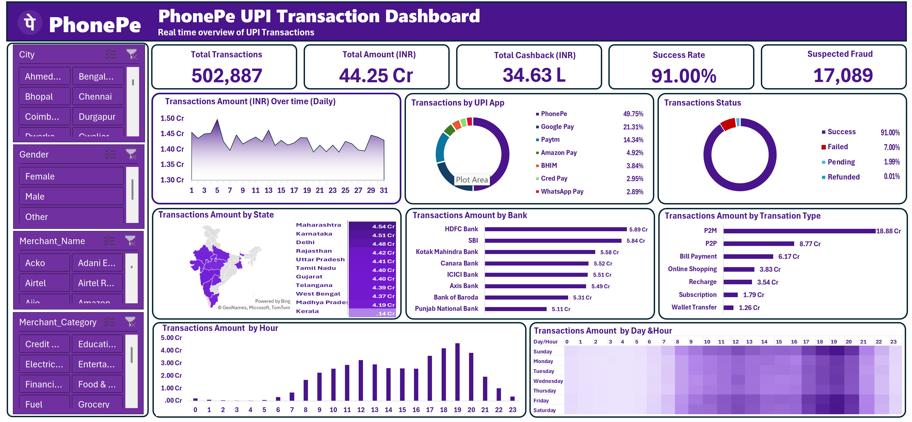

# 📱 PhonePe UPI Transactions Analysis | Microsoft Excel

> **Interactive Excel dashboard for UPI transaction performance, transaction behavior, success/failure analysis, and business-focused reporting.**


## 📊 Project Overview

This project analyzes **PhonePe UPI transaction data entirely in Microsoft Excel** and presents the results through an interactive, management-friendly dashboard.

The project demonstrates how raw transaction data can be converted into a structured reporting solution using Excel — without relying on Power Query or Power BI.

### Business Flow

`Raw Transaction Data → Excel Analysis → KPI Reporting → Interactive Dashboard → Business Insights`

---

## 🎯 Business Objective

The dashboard is designed to answer practical business questions such as:

- How much transaction value is being processed?
- How many transactions are being recorded?
- What is the overall transaction success rate?
- Which transaction categories contribute the most value?
- Which states, banks, apps, or transaction types show stronger performance?
- When are transaction volumes/value highest during the day?
- Where are failures or weaker transaction outcomes concentrated?

The goal is not only to display numbers, but to turn transaction data into **decision-support information**.

---

## 🖼️ Dashboard Preview

### PhonePe UPI Transaction Dashboard



> **Tip for recruiters:** Open the image full-size to see the KPI cards, charts, filters, and transaction analysis in detail.

---

## 📌 Key Metrics

The dashboard highlights major transaction KPIs including:

| KPI | Dashboard Value |
|---|---:|
| 💰 Transaction Amount | **₹44.25 Cr** |
| 🔢 Transactions | **502K+** |
| ✅ Success Rate | **~91%** |

These figures are based on the dashboard's current/default view and may change when filters are applied.

---

## 🔎 Analysis Covered

### 1. Transaction Performance
- Total transaction amount
- Transaction volume
- Successful vs unsuccessful transactions
- Success-rate monitoring

### 2. Transaction Category Analysis
- Transaction type/category performance
- Value contribution by transaction type
- Volume comparison across categories

### 3. Geographic Analysis
- State-level transaction performance
- Identification of high- and low-performing regions

### 4. Banking & App Analysis
- Bank-wise transaction analysis
- App-wise transaction contribution
- Comparison of transaction performance across financial participants

### 5. Time Analysis
- Hour-wise transaction activity
- Peak transaction periods
- Day × hour transaction pattern / heatmap

### 6. Risk / Exception View
- Transaction outcome monitoring
- Failure concentration
- Fraud indicator analysis where available in the dataset

---

## 💡 Business Insights

The dashboard provides several useful business-level observations:

- **₹44.25 Cr+** transaction value indicates a high-volume digital payment dataset suitable for operational analysis.
- **91% success rate** provides a clear KPI for monitoring transaction reliability.
- **P2M transactions** are a major contributor to transaction value in the analyzed data.
- **PhonePe** represents a strong share of the analyzed transaction activity.
- Transaction activity shows a noticeable **evening/peak-hour pattern**, making time-of-day analysis useful for operational planning.
- State, bank, transaction-type, and hourly views can be used to identify where transaction performance is strongest or where exceptions need attention.
- The **day × hour heatmap** helps identify recurring periods of high transaction activity.

> These observations are based on the current dashboard view; filter selections can change the results.

---

## 🛠️ Tools & Techniques

**Primary Tool:** Microsoft Excel

**Demonstrated Skills:**
- Data cleaning / preparation in Excel
- Data analysis
- KPI development
- Transaction performance analysis
- Comparative analysis
- Dashboard design
- Charts & visual reporting
- Interactive filtering
- Business insight generation

### Important Technical Note

**Power Query was not used in this project.** The project intentionally demonstrates the ability to perform analysis and build a reporting dashboard directly in Excel.

---

## 🧠 What This Project Demonstrates

This project is especially relevant for **MIS Executive, Reporting Analyst, Data Analyst, Operations Analyst, and Business Analyst** entry-level roles because it demonstrates:

- Converting raw operational data into useful reports
- KPI-focused reporting
- Finding patterns instead of only presenting tables
- Building management-friendly dashboards
- Thinking in terms of business questions and decisions
- Communicating analytical findings visually

---

## 📁 Repository Structure

```text
PhonePe-UPI-Transaction_Dashboard/
├── README.md
├── PhonePay.png
├── Excel/
│   └── README.md
└── Documentation/
    └── Business_Insights.md
```

---

## 🚀 How to Explore

1. Open the dashboard preview above.
2. Review the KPI cards and overall transaction performance.
3. Explore transaction type, state, bank, app, and time-based analysis.
4. Use the available filters/interactions to investigate specific segments.
5. Read `Documentation/Business_Insights.md` for the business interpretation of the dashboard.

---

## 👨‍💻 Project Ownership

**Independently developed portfolio project by Sushil** to demonstrate practical Excel-based data analysis and business reporting skills.

---

## ⭐ Why This Project Matters

A strong analyst does more than create charts. The important skill is being able to move from:

**Data → KPI → Pattern → Business Problem → Insight → Decision**

This project demonstrates that workflow using **Microsoft Excel as the primary analytical tool**.
